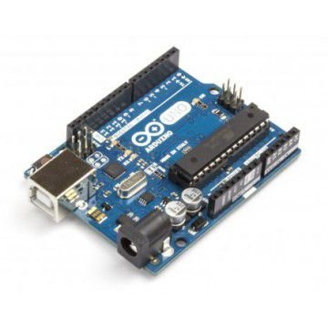
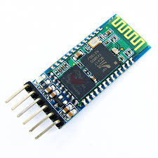
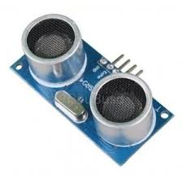
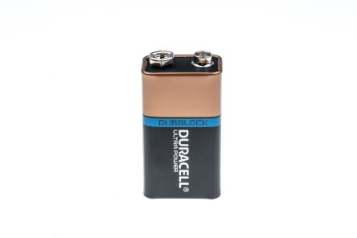
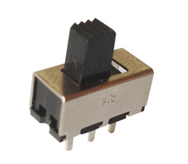
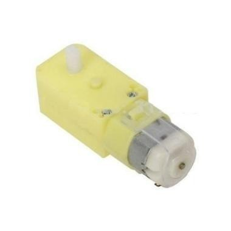
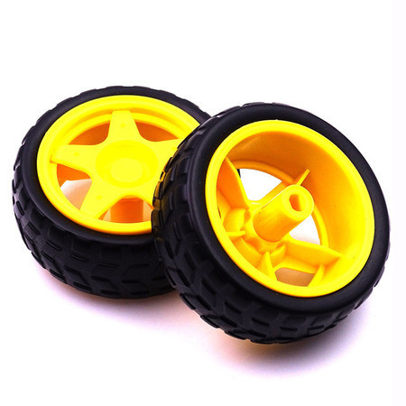
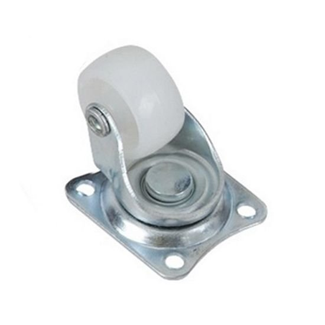

# Overflow
Uma proposta do projeto de um rôbo opensource para prática de robótica utilizando o microcontrolador Arduíno Uno e alguns componentes de apoio.

**WORKING IN PROGRESS...**

## Índice
> utilize para apoiar sua navegação.
- [Objetivos](#objetivos)
- [Construção](#construção)
    - [Componentes Eletrônicos](#componentes-eletrônicos)
    - [Esquema de Ligações](#esquema-de-ligações)
    - [Codificação e Upload](#codificação-e-upload)
    - [Controle Remoto](#controle-remoto)
    - [Funcionamento](#funcionamento)
- [Contribuição](#contribuição)
- [FAQ](#faq)
- [Versões](#versões)
- [Autor](#autor)
- [Licença](#licença)


## Objetivos
O projeto surge com o planejamento do lançamento de duas verões.

### versão alpha
* Supporte a comandos através de Bluetooh.
* Operar de forma autônoma com sensor ultrassônico.

### versão beta
* Permitir sua programação através de blocos lógicos.

## Construção

### Componentes Eletrônicos
Abaixo a lista de componentes necessários:
- Arduino UNO, Nano ou Mini

|| 
|:--:| 
| *Arduino UNO* |

- Módulo Bluetooh serial HC-05

||
|:--:| 
| *Bluetooh serial HC-05* |

- Mini Ponte H de 2 canais

||
|:--:| 
| *Ponte H* |


- Módulo Ultrassônico HC-SR04

||
|:--:| 
| *Ultrassônico HC-SR04* |

- Bateria de 9V

||
|:--:| 
| *Bateria 9 volts* |

- Chave HH 2 posições

||
|:--:| 
| *Chave HH 2 posições* |

- 2 Motores DC 3–6V com caixa de redução

||
|:--:| 
| *Motor com caixa de redução* |

- 2 Rodas de 70mm x 25mm

||
|:--:| 
| *Rodas* |

- 1 Rodizio Giratório (roda boba) 

||
|:--:| 
| *Rodízio Giratório* |

- Fios e conectores

### Esquema de Ligações

What things you need to install the software and how to install them

```
Give examples
```

### Codificação e upload

A step by step series of examples that tell you how to get a development env running

Say what the step will be

```
Give the example
```

And repeat

```
until finished
```

End with an example of getting some data out of the system or using it for a little demo

### Controle Remoto

Explain how to run the automated tests for this system

### Funcionamento

Explain how to run the automated tests for this system

## Contribuição

Please read [CONTRIBUTING.md](https://gist.github.com/PurpleBooth/b24679402957c63ec426) for details on our code of conduct, and the process for submitting pull requests to us.

## FAQ

Please read [CONTRIBUTING.md](https://gist.github.com/PurpleBooth/b24679402957c63ec426) for details on our code of conduct, and the process for submitting pull requests to us.

## Versões

We use [SemVer](http://semver.org/) for versioning. For the versions available, see the [tags on this repository](https://github.com/your/project/tags). 

## Autor

* **Flávio Fagundes** - *Responsável* - [PurpleBooth](https://flaviofagundes.com.br)

See also the list of [contributors](https://github.com/your/project/contributors) who participated in this project.

## Licença

This project is licensed under the MIT License - see the [LICENSE.md](LICENSE.md) file for details